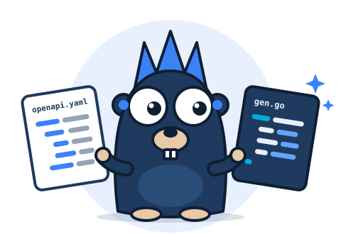

<h1 align="center">
  <br>
  mockzilla-codegen
</h1>

<div align="center">

[](https://github.com/mockzilla/mockzilla-codegen/actions/workflows/ci.yaml?query=branch%3Amain)
[](https://codecov.io/gh/mockzilla/mockzilla-codegen)
[](https://pkg.go.dev/github.com/mockzilla/mockzilla-codegen)
[](LICENSE)

</div>

Go models, HTTP servers, clients and MCP tools from OpenAPI 3.0, 3.1 and 3.2 specs.

The goal is a generator that fits your project. The config says where every file goes. Any block of
the built-in templates can be replaced. The output reads like Go a person wrote.

## Why this one

- An integration test generates, builds and runs the code of 2,200+ real-world specs.
- You place every file: one file, many files, or a package per part
  ([output files](docs/config.md#output-files)).
- Pointers only where a value can be missing, `allOf` merged into one struct, one shape for every
  union ([types](docs/types.md)).
- Validation is plain Go code, no reflection ([validation](docs/validation.md)).
- Each documented error response can be a Go error type ([error types](docs/errors.md)).
- One spec gives a server for any of 14 routers, a client that streams, and MCP tools for AI
  assistants ([server](docs/server.md), [client](docs/client.md), [MCP](docs/mcp.md)).

Coming from another generator? The [migration guides](docs/migration.md) say what changes and show
the code before and after.

## Quick start

Go 1.26 or newer.

```sh
go get -tool github.com/mockzilla/mockzilla-codegen/cmd/mockzilla-codegen
go tool mockzilla-codegen generate openapi.yaml               # models in ./gen.go
go tool mockzilla-codegen generate openapi.yaml -server chi   # and a chi server
go tool mockzilla-codegen generate -c codegen.yaml            # what the config lists
```

## Example

This spec:

```yaml
paths:
  /pets/{id}:
    get:
      operationId: getPet
      parameters:
        - {name: id, in: path, required: true, schema: {type: integer}}
      responses:
        "200":
          description: ok
          content: {application/json: {schema: {$ref: "#/components/schemas/Pet"}}}
components:
  schemas:
    Pet:
      type: object
      required: [id, name]
      properties:
        id: {type: integer}
        name: {type: string, maxLength: 64}
        tag: {type: string}
```

gives this, among other code:

```go
type Pet struct {
	ID   int     `json:"id"`
	Name string  `json:"name"`
	Tag  *string `json:"tag,omitempty"`
}

func (p Pet) Validate() error {
	var errs validation.Errors
	errs.Append("name", validation.MaxLength(p.Name, 64))
	return errs.Err()
}

type ServiceInterface interface {
	// GetPet handles GET /pets/{id}.
	GetPet(ctx context.Context, opts *GetPetServiceRequestOptions) (*GetPetResponseData, error)
}
```

You implement the service. The generated router decodes the request and writes the response:

```go
type pets struct{}

func (pets) GetPet(ctx context.Context, opts *api.GetPetServiceRequestOptions) (*api.GetPetResponseData, error) {
	return api.NewGetPetResponseData(&api.Pet{ID: opts.PathParams.ID, Name: "Rex"}), nil
}

http.ListenAndServe(":8080", api.NewRouter(pets{}))
```

## Docs

| Guide | What it covers |
|---|---|
| [Getting started](docs/getting-started.md) | install, commands, checking generated files in CI, the runtime guard |
| [Configuration](docs/config.md) | every key, output files, defaults |
| [Types](docs/types.md) | how schemas become Go types: unions, `allOf`, nullable values |
| [Naming](docs/naming.md) | how names are built and how clashes are resolved |
| [Validation](docs/validation.md) | the generated checks for requests and responses |
| [Error types](docs/errors.md) | response types that are Go errors |
| [Extensions](docs/extensions.md) | the `x-go-*` extensions and masking of sensitive values |
| [Server](docs/server.md) | the service interface, the HTTP adapter, 14 routers, starter files |
| [Client](docs/client.md) | one method per operation, envelopes, streams |
| [MCP](docs/mcp.md) | MCP tools over the client |
| [Templates](docs/templates.md) | replacing template blocks, extra files from your own templates |
| [Migration](docs/migration.md) | moving from another generator |

## Contributing

Issues and pull requests are welcome. [CONTRIBUTING.md](CONTRIBUTING.md) lists the make targets, the
checks a pull request has to pass, and how to add a router.

## License

MIT, see [LICENSE](LICENSE). The Go gopher was designed by Renée French and is licensed under
[CC BY 4.0](https://creativecommons.org/licenses/by/4.0/). The gopher above is a new drawing of it.
